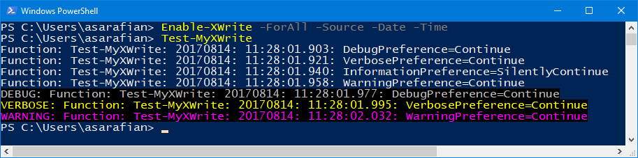

# XWrite

PowerShell module that enhances the output of the following core (`Microsoft.PowerShell.Utility`) cmdlets:
- `Write-Host`
- `Write-Debug`
- `Write-Verbose`
- `Write-Information`
- `Write-Warning`

| PowerShell normal output | PowerShell output with XWrite enabled |
| ------------------------ | ------------------------------------- |
|   |  |

The output can be enhanced with the following extra information:

- The **Caller** that is the name of the script or module that execute the `Write-` cmdlet.
- The **Date** that is the date part of the current date.
- The **Time** that is the time part of the current date.

The enhancement works by placing a global implementation of the respected cmdlet over the core one from the `Microsoft.PowerShell.Utility` namespace. This effectively overwrites the default behavior.

**Note:** Make sure you invoke `Enable-XWrite` at the beginning of the script. Think about including this with each session.

**Note:** The module's overwrite does not work for binary modules or modules that explicitly use the full namespace of the `Write-*` cmdlets.

# Known issues

There might be potential issues with type casting for the `Write-Host` and `Write-Information` when non string values are used. For more information look into the **How does it work?** section below.

# Commandlets

- Enable-XWrite
- Disable-XWrite

# Examples

## Showcase script

To showcase the functionality let's assume that e.g `Test-XWrite.ps1` exists like this

```powershell
$DebugPreference="Continue"
$VerbosePreference="Continue"
$InformationPreference="Continue"

$message="Hello"

Write-Host $message
Write-Debug $message
Write-Verbose $message
Write-Information $message
Write-Warning $message
```

## Example 1

```powershell
# Enhance all supported Write-* cmdlets
Enable-XWrite -ForAll

# Enhance specific Write-* cmdlets
Enable-XWrite -ForDebug -ForVerbose -ForInformation -ForWarning -ForHost

```

When executing `Test-XWrite.ps1` the output is the same

```text
DEBUG: Test-XWrite.ps1: Hello
VERBOSE: Test-XWrite.ps1: Hello
Test-XWrite.ps1: Hello
WARNING: Test-XWrite.ps1: Hello
```


**Notice** the extra information `Test-XWrite.ps1: ` between the e.g. `DEBUG` and `Hello`.

## Example2

```powershell
# Enhance all supported Write-* cmdlets and specify the artifacts in the output
Enable-XWrite -ForAll -Caller -Date -Time

# Enhance all supported Write-* cmdlets and specify custom format
Enable-XWrite -ForAll -Format "%caller%: %date%: %time%: "
```

When executing `Test-XWrite.ps1` the output is

```text
Test-XWrite.ps1: 20170804: 10:57:27.831: Hello
DEBUG: Test-XWrite.ps1: 20170804: 10:57:27.845: Hello
VERBOSE: Test-XWrite.ps1: 20170804: 10:57:27.858: Hello
Test-XWrite.ps1: 20170804: 10:57:27.871: Hello
WARNING: Test-XWrite.ps1: 20170804: 10:57:27.886: Hello
```



**Notice** the extra information `Test-XWrite.ps1: 20170804: 10:57:27.845: ` between the e.g. `DEBUG` and `Hello`.

# Formatting

The module will add a prefix to the output with the following logic:

- When no parameters are provided then only the **Caller** is added. e.g. `Test-XWrite.ps1`.
- When the `-Caller` or `-Date` or `-Time` is specified, then their respected values are added using the optional value of the `-Separator` parameter with value `: `.
- When `-Format` is specified then that custom format is used. The format can interpret `%caller%`,`%date%` and `%time%` variables.

This matrix that puts all above together in simple mapping:

| Variable | Parameter | Example value | Remarks |
|:-------- | --------- | ------------- | ------- |
| `%caller%` | `-Caller` | Test-XWrite.ps1 | The name of the caller script or cmdlet |
| `%date%` | `-Date` | 20170804 | the date stamp formatted as `yyyyMMdd` |
| `%time%` | `-Time` | 10:57:27.858 | the time stamp formatted as `hh:mm:ss.fff` |

# How does it work?

**XWrite** creates the implementation of each respected `Write-` command with the exact same signature but the implementation is a bit different to allow injecting the extra output. What happens inside each overwrite, is that before executing the actual function, the incoming parameters are modified and the extra value is added. For example for the `Write-Verbose`

1. Calculate extra values.
1. Retrieve the formatting expression.
1. Render the extra prefix.
1. Modify the incoming parameters. In the case of `Write-Verbose` modify the `-Message` parameter.
1. Execute the stepable pipeline for the `Microsoft.PowerShell.Utility\Write-Verbose` using the `PSBoundParameters`.

The overwrite's command definition can be always acquired by the debug output when enabling or by the in memory definition e.g. `(Get-Command Write-Verbose).Definition

This is the a matrix that shows which parameter is modified for each core cmdlet, it's type and potential issue that can be improved.

| Command | Parameter name | Parameter type | Remarks |
| ------- | -------------- | -------------- | ------- |
| Write-Debug | `-Message` | `string` | |
| Write-Verbose | `-Message` | `string` | |
| Write-Warning | `-Message` | `string` | |
| Write-Information | `-MessageData` | `System.Object` | Potential issues with type casting |
| Write-Host | `-Message` | `System.Object` | Potential issues with type casting |

This is the generated overwrite for `Write-Verbose`

```powershell
[CmdletBinding(HelpUri='https://go.microsoft.com/fwlink/?LinkID=113429', RemotingCapability='None')]
param(
    [Parameter(Mandatory=$true, Position=0, ValueFromPipeline=$true)]
    [Alias('Msg')]
    [AllowEmptyString()]
    [string]
    ${Message})

begin
{
    try {

        #region Begin step injection

        $callerName=(Get-PSCallStack)[1].Command
        $dateStamp=Get-Date -Format "yyyyMMdd"
        $timeStamp=Get-Date -Format "hh:mm:ss.fff"
        # $callerParameterSetName=$null
        $prefix=Get-Variable -Name "RichWrite:Prefix" -Scope Global -ValueOnly
        $prefix=$ExecutionContext.InvokeCommand.ExpandString($prefix)

        $PSBoundParameters.Message=$prefix+$PSBoundParameters.Message

        #endregion

        $outBuffer = $null
        if ($PSBoundParameters.TryGetValue('OutBuffer', [ref]$outBuffer))
        {
            $PSBoundParameters['OutBuffer'] = 1
        }
        $wrappedCmd = $ExecutionContext.InvokeCommand.GetCommand('Microsoft.PowerShell.Utility\Write-Verbose', [System.Management.Automation.CommandTypes]::Cmdlet)
        $scriptCmd = {& $wrappedCmd @PSBoundParameters }
        $steppablePipeline = $scriptCmd.GetSteppablePipeline($myInvocation.CommandOrigin)
        $steppablePipeline.Begin($PSCmdlet)
    } catch {
        throw
    }
}

process
{
    try {
        $steppablePipeline.Process($_)
    } catch {
        throw
    }
}

end
{
    try {
        $steppablePipeline.End()
    } catch {
        throw
    }
}
<#

.ForwardHelpTargetName Microsoft.PowerShell.Utility\Write-Verbose
.ForwardHelpCategory Cmdlet

#>   
```

# Develop and debug

At this moment there are no Pester tests, although there isn't much possible to test as I'm not aware how the output of the `Write-*` could be asserted. Still, Pester tests for stability and parameter contract consistency should be implemented.

Since the module interferes with the core cmdlets, this section is to share how to develop and debug.

**Note** always use the `Microsoft.PowerShell.Utility` when referencing `Write-* cmdlets in the implementation. This will make sure that when developing, if the overwrite cmdlet is broken, the system one will be used.

This is my debug script

```powershell
Set-StrictMode -Version latest

Import-Module .\Source\Modules\XWrite\XWrite.psm1 -Force

# Set all levels active for output verification
$DebugPreference="Continue"
$VerbosePreference="Continue"
$InformationPreference="Continue"

$WhatIfSplat=@{
# Comment/Uncomment to enable WhatIf
#    WhatIf=$true
}

# Disable the functionality
Disable-XWrite @WhatIfSplat

$message="When disabled"
Write-Host $message
Write-Host $message -ForegroundColor Yellow -BackgroundColor DarkBlue
Write-Debug $message
Write-Verbose $message
Write-Information $message
Write-Warning $message

# Chose a variation
Enable-XWrite -ForAll @WhatIfSplat
# Enable-XWrite -ForAll -Caller -Date -Time @WhatIfSplat
# Enable-XWrite -ForAll -Format "%caller% %date% %time%" @WhatIfSplat

$message="When enabled"
Write-Host $message
Write-Host $message -ForegroundColor Yellow -BackgroundColor DarkBlue
Write-Debug $message
Write-Verbose $message
Write-Information $message
Write-Warning $message
```

and outputs

```text
When disabled
When disabled
DEBUG: When disabled
VERBOSE: When disabled
When disabled
WARNING: When disabled

<ScriptBlock>: 20170804: 11:25:42.435: When enabled
<ScriptBlock>: 20170804: 11:25:42.449: When enabled
DEBUG: <ScriptBlock>: 20170804: 11:25:42.461: When enabled
VERBOSE: <ScriptBlock>: 20170804: 11:25:42.479: When enabled
<ScriptBlock>: 20170804: 11:25:42.496: When enabled
WARNING: <ScriptBlock>: 20170804: 11:25:42.509: When enabled
```

**Notice** that the **Caller** is now `<ScriptBlock>` as this is an unsaved script. If you save it then it becomes the name of the script.

# Backlog

1. Add pester tests to safeguard cmdlet contract consistency.
1. Improve the overwrite's implementation when the parameter is of type `System.Object` for 
    - `Write-Host`.
    - `Write-Information`.